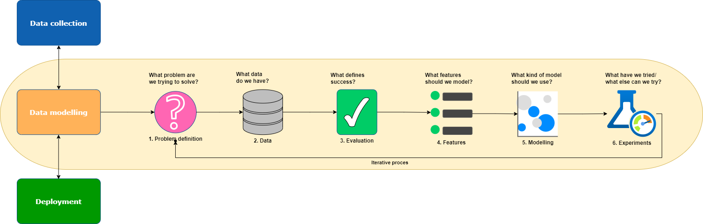
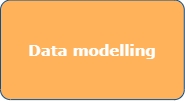
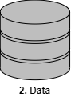

# 5. C4 model en workflow

## 2.1 Inleiding

Het C4-model is ontwikkeld om softwareontwikkelteams te helpen bij het beschrijven en communiceren van softwarearchitectuur, zowel tijdens ontwerpsessies als bij het achteraf documenteren van een bestaande codebase.
Om het inzichtelijk te maken ga ik ga ik van de verschillende niveaus een model maken.

<br>

# Landscape model


In dit landschap model geef ik weer hoe een gebruiker/familielid met het software 'system' interacteert.
Een losse docker container omvat een gui interface(`Frontend`) waarmee de gebruiker zijn automations kan inzien, aan- en toe kan passen.

De `frontend` communiceert op zijn beurt met de API. Deze zal de juiste opdrachten doorsturen naar `Home Assistant` om gegevens op te halen of naar het `Automate Automations` systeem om een automation te laten genereren.

Het `Automate Automations` systeem omvat een getraind model om gebruikersgedrag te herkennen en het model om automations te genereren. Daarnaast bevindt zich er nog een module die de data modelleert zodat de modellen de voorspellingen kunnen doen.

<br>

# C1 - System Context model


Dit is een mdel om weer te geven waar de focus ligt tussen de personen, dit gevel de Home Assistant gebruiker and de software systemen die betrokken zijn.

<br>

# C2 - Container model


```
In wezen is een container een afzonderlijk uitvoerbare/plaatsbare eenheid (bijvoorbeeld een afzonderlijke procesruimte) die code uitvoert of gegevens opslaat.

Het containerdiagram toont de vorm op hoog niveau van de softwarearchitectuur en hoe de verantwoordelijkheden erover zijn verdeeld. Het toont ook de belangrijkste technologische keuzes en hoe de containers met elkaar communiceren. Het is een eenvoudig, high-level technologiegericht diagram dat nuttig is voor softwareontwikkelaars en ondersteunend/operationeel personeel.
```

In dit geval maakt de gebruiker verbinding met een webpagina waar hij een overzicht heeft van zijn sensoren, automations die wel en niet gegenereerd zijn door het model. Deze webpagina zal gemaakt worden in Javascript en zal de opdrachten voor het opvragen van data en uitvoeren van commando's versturen via API calls.

Afhankelijk van wat de gebruiker gekozen wordt zullen de opdrachten naar de juiste systemen verzonden worden.

De contain `ML automations generator Application` bevat een getraind model dat op basis van inputparameters een automation kan genereren. Daarnaast bevat het de functie om de data die in Home Assistant staat te modelleren. Dit is noodzakelijk omdat de data anders niet geschikt is voor het getrainde model.

<br>

# C3 Component model


De `API Application` zal via een API call ervoor kiezen om een automation te genereren met bepaalde parameters of op regelmatige interval een API call uitvoeren om de data waarop het model een voorspelling moet doen te modelleren. 

Nu worden er API calls gedaan vanuit de `API Application`, ik heb hiervoor gekozen om het proces gescheiden te houden in het diagram. In werkelijk zal er 1 API aanwezig zijn met 2 verschillende endpoints. Op basis van de eindpoint wordt het ene proces of het andere proces aangeroepen.

Je zou nog kunnen overwegen om een scheduler in te bouwen zodat op bepaalde interval basis de data al gemodelleerd wordt. Omdat het modelleren van data veel tijd en systeembronnen kost is het verstandig dit op regelmatige basis te doen waardoor de delta klein blijft en het proces sneller klaar is.


# Data modelling workflow

Dit is een standaard workflow die toegepast kan worden op een volledig machine learning project.
In grote lijnen geeft het weer welke stappen er doorlopen moeten worden en in welke volgorde.

Ik zal per onderdeel een korte uitleg geven hoe dit in mijn project toegepast gaat worden.

<br>


**Data Collection**: Dit is een cruciale eerste stap. Het is belangrijk ervoor te zorgen dat de gegevens(data) die verzamelt worden relevant zijn voor het probleem dat ik probeer op te lossen. In mijn geval wil ik automations genereren, hiervoor moet ik een grote dataset hebben met bestaande automations. Een simpele automation is de lampen(of specifieke) aan doen wanneer de zon onder is. Een automation bestaat eigenlijk uit 3 stappen. Een trigger, conditie(voorwaarde) en een actie.

<br>

 **Data Modelling**: In deze stap moet er gekeken worden wat de dataset bevat. Zo mogen er geen lege velden voorkomen. Een leeg veld heeft nadelige invloed in het trainen van het model. De meeste modellen werken met getallen, er zal gekeken moeten worden of de gegevens in de dataset aangepast kunnen worden.
Zo kan simpel een true of false waarde vertaald worden naar een 0 of 1.

Als laatste waar op gelet moet worden zijn de verschillen tussen de waardes. Bijvoorbeeld als je een prijs van een huis gaat voorspellen en deze voorkomt als 650000 kan het zijn dat het model hier een hogere waarde aan kent tijdens het voorspellen wat het voorspellen erg kan beïnvloeden.
Door de getallen dichter op elk te zetten kan het model nauwkeuriger voorspellen. Je kan er dan voor kiezen om de kolom prijzen aan te passen en de bedragen te delen door 1000.

<br>

 **"Deployment"**: In de context van de workflow voor machine learning verwijst dit naar de integratie van het model voor machine learning in een productieomgeving waar het voorspellingen kan doen op nieuwe gegevens. Dit is de fase waarin het model, na training en validatie, gebruikt wordt.

<br>

 **Problem definition**: Het probleem duidelijk definiëren. Dit is een cruciale stap. Het is belangrijk om te begrijpen wat wil ik gaan voorspellen en welke gegevens heb ik. Het heeft geen zin om een model te trainen als niet duidelijk is wat ik wil voorspellen of dat de aanwezige data niet toereikend is.

<br>

 **Data**:
In deze stap wordt er naar de data gekeken. Dit kan raar klinken maar na het opschonen en gereed maken van de data om een model te trainen moet de data ook begrepen worden. Een goede methode is om grafieken van te maken. Hierdoor wordt je gedwongen om erover na te denken wat in een later stadium gebruikt kan worden bij de validatie van het model.

<br>

 **Evaluation**: Bepalen hoe succes eruit ziet. Ben ik tevreden bij een bepaalde score hoe het model functioneert of dat het model een bepaalde waarde goed weet te schatten.

<br>

 **Feature engineering**: Beslissen welke kenmerken er gemodelleerd moeten worden. Dit kan betekenen dat uit de bestaande gegevens nieuwe kenmerken worden gecreëerd die meer informatie opleveren voor het model. Dit kan complex klinken maar denk aan het voorspellen wanneer iemand een hartziekte heeft. Als deze voorspelling goed genoeg is kan deze waarde weer gebruikt worden in andere voorspellingen.

<br>

 **Modelling**: In deze stap kunnen verschillende soorten modellen worden uitgeprobeerd en de parameters ervan worden afgestemd.

Na het proberen van verschillende modellen volgt automatisch modelvalidatie. Wanneer je een model traint op de trainingsset en vervolgens evalueert op de testset. Kan er bepaald worden hoe het model zich gedraagt. Als vervolgstap kan er een fijnafstemming plaatsvinden door het automatisch aanpassen van hyperparameters(specificieke paramters, deze kunnen verschillen per model) om tot een beter resultaat te komen.

<br>

 **Experiments**: Een belangrijke stap, probeer eens een ander model om de gemaakte keuzes na te gaan of deze wel goed zijn of dat een ander model misschien toch beter presteerd.

<br>


## Bronnen

- Brown, Simon (2017, 12 oktober). The C4 model for visualising software architecture. c4model.com. https://c4model.com/