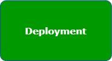
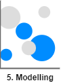

# 5. C4 model en workflow

## 2.1 Inleiding

Het C4-model is ontwikkeld om softwareontwikkelteams te helpen bij het beschrijven en communiceren van softwarearchitectuur, zowel tijdens ontwerpsessies als bij het achteraf documenteren van een bestaande codebase.
Om het inzichtelijk te maken ga ik ga ik van de verschillende niveaus een model maken.

<br>

# Landscape model


In dit landschap model geef ik weer hoe een gebruiker/familielid met het software 'system' interacteert.
Een losse docker container omvat een gui interface(`Frontend`) waarmee de gebruiker zijn automations kan inzien, aan- en toe kan passen.

De `frontend` communiceert op zijn beurt met de API. Deze zal de juiste opdrachten doorsturen naar `Home Assistant` om gegevens op te halen of naar het `Automate Automations` systeem om een automation te laten genereren.

Het `Automate Automations` systeem omvat een getraind model om gebruikersgedrag te herkennen en het model om automations te genereren. Daarnaast bevindt zich er nog een module die de data modelleert zodat de modellen de voorspellingen kunnen doen.

<br>

# C1 - System Context model


Dit is een mdel om weer te geven waar de focus ligt tussen de personen, dit gevel de Home Assistant gebruiker and de software systemen die betrokken zijn.

<br>

# C2 - Container model


```
In wezen is een container een afzonderlijk uitvoerbare/plaatsbare eenheid (bijvoorbeeld een afzonderlijke procesruimte) die code uitvoert of gegevens opslaat.

Het containerdiagram toont de vorm op hoog niveau van de softwarearchitectuur en hoe de verantwoordelijkheden erover zijn verdeeld. Het toont ook de belangrijkste technologische keuzes en hoe de containers met elkaar communiceren. Het is een eenvoudig, high-level technologiegericht diagram dat nuttig is voor softwareontwikkelaars en ondersteunend/operationeel personeel.
```

In dit geval maakt de gebruiker verbinding met een webpagina waar hij een overzicht heeft van zijn sensoren, automations die wel en niet gegenereerd zijn door het model. Deze webpagina zal gemaakt worden in Javascript en zal de opdrachten voor het opvragen van data en uitvoeren van commando's versturen via API calls.

Afhankelijk van wat de gebruiker gekozen wordt zullen de opdrachten naar de juiste systemen verzonden worden.

De contain `ML automations generator Application` bevat een getraind model dat op basis van inputparameters een automation kan genereren. Daarnaast bevat het de functie om de data die in Home Assistant staat te modelleren. Dit is noodzakelijk omdat de data anders niet geschikt is voor het getrainde model.

<br>

# C3 Component model


De `API Application` zal via een API call ervoor kiezen om een automation te genereren met bepaalde parameters of op regelmatige interval een API call uitvoeren om de data waarop het model een voorspelling moet doen te modelleren. 

Nu worden er API calls gedaan vanuit de `API Application`, ik heb hiervoor gekozen om het proces gescheiden te houden in het diagram. In werkelijk zal er 1 API aanwezig zijn met 2 verschillende endpoints. Op basis van de eindpoint wordt het ene proces of het andere proces aangeroepen.

Je zou nog kunnen overwegen om een scheduler in te bouwen zodat op bepaalde interval basis de data al gemodelleerd wordt. Omdat het modelleren van data veel tijd en systeembronnen kost is het verstandig dit op regelmatige basis te doen waardoor de delta klein blijft en het proces sneller klaar is.


# Data modelling workflow








<br>

## Bronnen

- Brown, Simon (2017, 12 oktober). The C4 model for visualising software architecture. c4model.com. https://c4model.com/