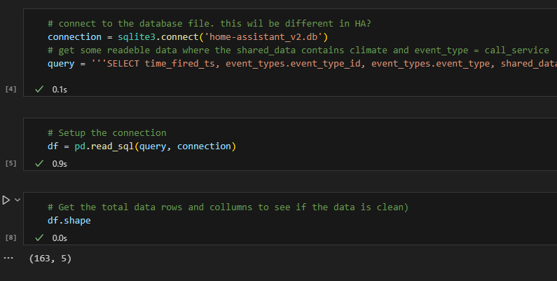

# PoC info
**Story:** [AA-32](https://prophecy1.atlassian.net/browse/AA-32)
**Onderdeel van:** *Wat zijn de voor en nadelen van de verschillende AI technologieën binnen Home assistant?*
- **Epic:** [AA-12](https://prophecy1.atlassian.net/browse/AA-12)
- **Onderzoeksvraag:** 
**Doel:** Het doel is om door middel van een proof of concept er achter te komen wat de grote voor en nadelen zijn van machine learning binnen Home Assistant. De volgende punten worden hierin meegenomen. 
- Data en data set
	- De data structuur
	- de hoeveelheid data
- Hardware
	- Wat kan de hardware qua performance aan 
	- wat kan de hardware qua data aan
**Onderzoeksmethode:** 
- Workshop: Prototyping
---

## Introductie

Voor het lezen van dit document is het aan te raden dat je eerst begrijpt hoe de datastructuur van home assistant is en welke data we hier voor nodig hebben. Hier is voorafgaand een analyse op gedaan middels een spike met daarbij een beknopte uitleg. Deze kan je vinden op de pagina [SPIKE Data Analyse](SPIKE%20Data%20Analyse.md).

Om een prototype te maken is er gebruik gemaakt van de Jupyter notebook plugin in vs Code. Deze software is gemaakt om een prototype te maken van bijvoorbeeld een machine learning model. In dit document wordt beschreven hoe bepaalde keuzes zijn gemaakt en wat de uitkomst is van de PoC.  

## Data importeren 

Bij het maken van de PoC zijn er verschillende data sets gebruikt. Hierin is er ook geëxperimenteerd wat hierin betere performance oplevert. 

In de onderstaande voorbeelden is te zien dat wanneer er veel data binnen word gehaald de tijd van ophalen aanzienlijk toeneemt. 

Zo is hier boven een wat extreem voorbeeld getoond waarin het ophalen van 163 rows en 5 kolommen aan data 0,9 seconden duurt en 6,9 seconden voor 41013 rows en 8 kolommen. 

Uiteraard zijn hier oplossingen voor te bedenken. Hier zou je bijvoorbeeld een cloud oplossing voor kunnen gebruiken waarin je de data van meerdere gebruikers in verzamelt en daar mee je modellen kan trainen. Deze oplossing zou zeer goed kunnen werken en zie je ook in bijvoorbeeld de Google Nest oplossing (hier word in de [SPIKE bestaande toepassingen](SPIKE%20bestaande%20toepassingen.md) naar gekeken. Het nadeel van deze oplossing is dat hier kosten aan zitten verbonden. Gezien Home Assistant een gratis platform is en dat over het algemeen ook zo wil blijven is het te vraag of dit een gewenste uitkomst is. 

Voor het importeren van data is het dus belangrijk om dit zo compact mogelijk te doen en dus bij de bron al de data af te scopen naar het geen wat er nodig is. 
Dit is niet alleen nodig voor de snelheid maar ook voor de hardware. Tijdens het trainen van grote datasets is het meerdere malen voor gekomen dat de instance crasht. Dit komt omdat Home Assistant niet zwaar is om te draaien op een computer en er om die reden dus niet hele goede hardware word gebruikt. 

## Model kiezen

Bij het trainen van een model zijn er een aantal punten waar je rekening mee moet houden. 
- Doel van je het model
- Wat is de beschikbare data die je kan gebruiken voor het model
- Met welke type data moet het model overweg
- Moet het model schaalbaar zijn
- De benodigde hardware voor je model

### doel

Voor dit project is om te kunnen voorspellen wanneer een event plaatsvind. Dit kan bepaalt worden door verschillende parameters. 
Concreet zal er dus op basis van de buiten en binnen temperatuur bepaalt worden of er een event word aangemaakt die de status van de thermostaat wijzigt. Een conditie hierbij is dat er een persoon aanwezig is. 

Dit voorbeeld is een goed voorbeeld voor een classificatie model. 

### Beschikbare data

De beschikbare data in dit project kan per persoon erg verschillen. Wanneer iemand enkel een thermostaat heeft en deze eens per dag aan en uit zet zal dit niet veel data genereren. In tegenstelling tot iemand die in iedere kamer een temperatuur meter heeft en een slimme thermostaat kraan heeft en ook nog een airco heeft aangesloten voor de hete zomerdagen. 

Daarnaast is het belangrijk om rekening te houden met een persoon die zijn home assistant op een Raspberry pi heeft staan of een server. Dit kan invloed hebben op de hoeveelheid data die er beschikbaar is. 

### Type data

Home Assistant slaat nagenoeg alle data op met een eigen id. Mocht dit niet het geval zijn, zijn er tools die tekstuele data om kunnen zetten naar id's 

Het type data is dus getallen of tekst

### Schaalbaarheid

Zoals eerder aangegeven kan de dataset waarmee getraind word variëren van klein tot groot. Denk hierbij aan 50 tot 1000 rijen aan data. In de termen van machine learning is dit erg weinig. 

Potentieel zou het een mogelijkheid om grotere datasets te verzamelen of verschillende datasets samen te voegen om hier mee te gaan trainen. 

Schaalbaarheid is dus gewenst maar geen harde eis. 

### Hardware

De gemiddelde hardware waar home assistant op draait is per definitie niet heel krachting. Om het model zo accuraat mogelijk te maken zou het beste zijn om met locale data te trainen maar het is ook zeker mogelijk om een vooraf getraind model te gebruiken. 

### Model keuze

Een erg populair model is bijvoorbeeld de [RandomForestClassifier](https://scikit-learn.org/stable/modules/generated/sklearn.ensemble.RandomForestClassifier.html#sklearn-ensemble-randomforestclassifier)van scikit-learn. De reden dat dit een populait model is is omdat het gebruik maakt van grote hoeveelheden beslissingsbomen. Dit heeft met name een toegevoegde waarde voor overfitting. 

Over fitting komt veel voor met kleinere datasets waardoor het model te accuraat word afgesteld op de trainingsgegevens. Dit zorgt er voor dat het trainen met nieuwe data moeilijker gaat. Door veel beslissingsbomen toe te passen kan de kans op overfitting verkleint worden. 

Daarnaast kan de RandomForestClassifier ook overweg met grotere datasets en accepteert het voor de input zowel tekst als nummers en zal het voor de output alleen nummering gebruiken. 

Als laatste overweging is ook de complexiteit van het model mee genomen. Omdat dit een eerste ervaring is met machine learning is het fijn om een makkelijk te leren model te kiezen. De RandomForestClassifier staat bekent om de simpliciteit en er is erg veel informatie over te vinden door zijn populariteit.

Uiteraard is het aan te raden om verschillende classificatie modellen te gebruiken maar omdat dit model aan alle harde eisen voldoet zal er eerst met dit model geëxperimenteerd worden.

## Trainen van het model

Wat erg belangrijk is om te weten is dat tijdens het trainen van het model er een beperkte hoeveelheid data beschikbaar was. Dit heeft erg veel invloed op de uitkomst van de modellen. Let dus op dat de uitkomst dus betrekking heeft op kleine datasets en er nog mogelijkheden zijn om dit onderzoek te doen met een grotere dataset. 

Voor het trainen van het model heb ik meerdere [iteraties](https://github.com/S7HaMachineLearning/AA_ML_BEHAVIOR/tree/main/notebooks) gedaan. 
Er zijn eerst 6 iteraties gedaan met het thermostaat model en nog eens 3 iteraties met een model om lampen aan te sturen. 

De verschillen in de aanpak zit met name in de type data die in het model word gestopt en het verwerken hiervan. 

### labels

De gelabelde data is de data die uit je model komt. Zie deze waarde als de voorspelling. Home Assistant heeft verschillende kolommen die deze waarde bevatten. De meest belangrijke hiervan is het event. De events binnen home assistant zijn de aanstichter van alle veranderingen. Je kan dus zeggen dat als het juiste event word voorspelt je doel is gehaald. 

Daarnaast heb je nog de kolommen state en attributes. Deze 2 kolommen geven de huidige staat van de entity aan. Wanneer je goed kan voorspellen wanneer deze waarde wijzigt naar de gewenste waarden dan is het mogelijk om hier een event aan te koppelen. 

Deze 3 labels zijn dus alle 3 geprobeerd. 

#### events

Het voorspellen van de events is er erg lastige taak met de beschikbare data. Dit komt om dat niet iedere row die we willen gebruiken bij het trainen van ons model een event bevat. Dit kan je op 2 manieren oplossen. 

1. Alle lege rijen verwijderen uit je tabel
Deze optie is niet wenselijk. Dit resulteert in een onbruikbare dataset omdat je alleen nog maar de entiteiten behoudt uit het domein climate. Je wil juist ook de entiteiten van een persoon en buiten temperatuur hebben. 

3. Alle lege event rijen vullen met de waarde 0
Deze optie is ook niet de beste optie. Hoewel de accuraatheid van het model heel hoog word is deze niet bruikbaar. 90% van de data bevat geen event waardoor het model heel goed word in het voorspellen van wanneer er geen event word aangemaakt. Dit is het tegenover gestelde van het doel, het voorspellen wanneer wel een event word aangemaakt. 

Om deze reden is de event als label niet geschikt voor het trainen van een model met een kleine dataset. 

#### State

De state bevat altijd maar een type waarde. In het geval van de thermostaat is de state de operation mode. Deze bestaat uit Heat of Auto. Deze waardes zijn niet bruikbaar voor het automatiseren van de thermostaat. Welk domein je wel heel goed kan automatiseren is light. Lampen binnen home assistant hebben de state 'on' of 'off'. Hier is dus ook op getraind. 

De uitkomst van dit model was erg goed met een score van 93% accuraatheid 

Dit model is zeker bruikbaar maar mist een belangrijk punt en dat zijn de attributes. In de attributes staat hoe helder de lam staat en welke kleur deze heeft. Dit zijn belangrijke gegevens om te hebben omdat veel lampen gedimd kunnen worden en het niet wenselijk is dat een lamp maximaal fel is terwijl deze eigenlijk gedimd moet zijn. 

#### Attributes

Zoals eerder aangegeven bevat de attributes kolom alle informatie die een lamt op een bepaald moment bevat. Denk hierbij aan de felheid, kleur, hoe snel de lamp aan gaat (transaction time) enzovoort. Voor de thermostaat staat hier in wat de gewenste temperatuur is en de huidige. Maar ook de modes van de modes van de thermostaat (away, home, comfort en sleep). Daarnaast staat er nog meer data in. 

Deze data is goed te gebruiken voor de voorspellingen zou je zeggen. Helaas is dit bij een kleine dataset niet het geval. door de grote variatie van informatie die in de kolom staat loopt het toewijzen van een id teveel uiteen. hierdoor kan er niet een juiste voorspelling gedaan worden. 

Wel kan je deze data extraheren uit de kolom en in een aparte kolom zetten. Het nadeel hiervan is dat je dan weer alleen de rijen van het domein climate hebt gevuld en je het model weer traint op wanneer de rij een leeg veld moet hebben. 

## Features

De features bij het trainen van een model zijn gemakkelijk te kiezen. Hier wil je met name de data van de triggers hebben. Dit zijn de volgende parameters. 
- tijd
- temperatuur binnen
- temperatuur buiten 
- aanwezigheid van een persoon. 

In tegenstelling van de labels waar je maar 1 waarde in kan stoppen kan je bij de features zoveel waardes in stoppen als je maar wil. 

Hier worden de volgende waardes in gestopt. 

- time_fired_ts 
	- dit is een het moment wanneer de state van een entiteit is aangepast of wanneer een event is aangemaakt
- State van een persoon (home/away)
attributes 

Helaas is het ook bij de features het zelfde probeem als bij de labels. Wanneer je de attributes toevoegt lopen de waardes er veel uiteen waardoor het moeilijk te voorspellen word op basis van een specifieke staat. Bij een grote dataset zou dit aanzienlijk beter zijn. 

## conclusie

Voor een kleine dataset uit home assistant is machine learning niet de juiste oplossing. Daar is de data te variabel voor. Ook  met grote datasets moet er uitgekeken worden voor falen. Omdat het trainen van een goed model rekenkracht vereist en de meeste computers waar home assistant op draait dat niet hebben. 

## Advies

Er zijn meerdere mogelijkheden die nog onderzocht kunnen worden. 
Voor het korte termijn is het verstandig om machine learning los te laten en te kijken of er een generieke oplossing bedacht kan worden die werkt met automations en custom sensoren. 
Voor het lange termijn kan er gekeken worden naar een custom sensor die een snapshot maakt van alle benodigde data wanneer de gebruiker een handmatige aanpassing doet aan zijn thermostaat. Met de data uit deze sensor is het vervolgens mogelijk om het model te trainen. Zo heb je altijd de juiste informatie bij de hand. Ook is het vervolgens makkelijker om een model te trainen die ook bruikbaar is voor een andere home assistant. 
