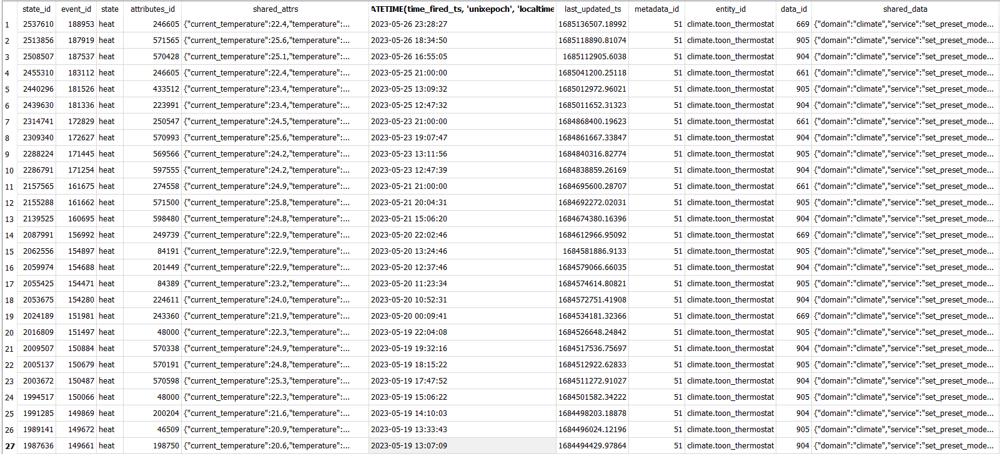

# Spike info
**Story:** [AA-29](https://prophecy1.atlassian.net/browse/AA-29)
**Onderdeel van:** *Hoe kan de data uit Home Assistant gebruikt worden voor de gekozen techniek.*
- **Epic:** [AA-2](https://prophecy1.atlassian.net/browse/AA-2)
- **Onderzoeksvraag:** 
**Doel:** *Het doel van deze spike is om in kaart te brengen hoe de database van home assistant in elkaarsteekt en hoe we de data zouden kunnen gebruiken. 
**Onderzoeksmethode:** 
- Lab: Data Analytics
---

## Inleiding

Om te kunnen begrijpen waarom Home Assistant bepaalde keuzes maakt hoe de data van het platform word opgeslagen is het belangrijk om de algemene visie van Home Assistant te weten. 

De founder van Home Assistant en Nabu Casa Paulus Schoutsen heeft Home Assistant in 2013 opgericht . De eerste versie van Home Assistant is in 2017 gelanseerd met als doel dit op een Raspberry Pi te kunnen draaien. Het doel van het platform is om alle smarthome apparatuur locaal in je eigen huis te kunnen draaien met daarbij ook je eigen locale data opslag.

Inmiddels is Home Assistant verder door ontwikkeld en is het mogelijk om dit op meerdere typen hardware te draaien zoals Virtual machines, tin clients en docker. 

## Data opslag

Omdat iedere eigenaar van een Home Assistant instance ook beheer heeft over zijn eigen data base is het dus lastig om massaal alle data op te slaan. Dit is dus de reden dat data beperkt beschikbaar is binnen het platform.

Er is wel een manier om de data set te vergroten als is dit niet aan te raden wanneer je gebruik maakt van een micro SD kaart. 
Wanneer je gebruik maakt van een installatie op een HDD of SSD kaart kan je het vlogende doen. 

Je instaleerd een add-on waarmee je vscode kan draaien in je instance zo dat je de config file kan bewerken en zet vervolgens de volgende code hier in. 

```
# Defineer eerst het domein die je wil aanpassen
recorder:
  # Pas de variable aan naar het aantal dagen dat jouw data opgeslagen blijft.
  # De default waarden is 7
  purge_keep_days: 90
```

## Database

Het standaard type database die Home Assistant gebruikt is een SQLlite database. Dit is een relationele database die relatief weinig recourses gebruikt. In de begin fase van home assistant stond de data base vooral bekend om de traagheid en de vele calls die deze maakte. Dit is de reden dat destijds veel gebruikers over zijn gestapt naar een MariaDB database. Deze is te installeren via een plugin en je zal vervolgens ook hiervoor een stuk code moeten toevoegen aan je config file. 

```
# Defineer eerst het domein die je wil aanpassen
recorder:
	# Defineer de url naar jouw database locatie.  
	db_url: 
```

In de afgelopen jaren (2022 en 2023) heeft Home Assistan veel aanpassingen gedaan aan de database met een van de grootse in update 2023.4. Inmiddels is de database aanzienlijk kleiner geworden doordat er dubbele data uit de database is gehaald. inmiddels is het dus zo dat het verschil in snelheid niet meer merkbaar tussen SQLlite en MariaDB. 

## Data structuur 

Sinds de laatste update van Home Assistant is de database flink versimpeld. Hieronder zie je een erd die laat zien hoe de relaties onderling liggen. 


De data binnen Home Assistant is event driven. Dat betekent dat iedere change binnen het platform een event aanmaakt die vervolgens de state van entity's aanpast. Ieder event wat word gegenereerd bevat een context id. Deze context id word gebonden aan alle events en states die daar uit voort vloeien.  

## Benodigde data project

Om te kunnen voorspellen wanneer een gebruiker de thermostaat aan/uit wilt zetten is het balangrijk om verschillende informatie te weten. Zoals welke omstandigheden spelen er wanneer de status word veranderd van de thermostaat? Dit is uit te lezen door de huidige status uit te lezen van verschillende entitys. Ook wil je weten wat de trigger is die er voor zorgt dat de thermostaat status doet veranderen. 

Wat zijn dan de entitys die invloed hebben op het gedrag van de gebruiker? 

De eerste invloed is de temperatuur, zowel die van binnen als buiten. Het is gebruikelijk als het binnen te koud word dat je de thermotaat aan zal zetten. Maar wanneer het buiten warm is zal men minder snel geneigd zijn om de thermostaat aan te zetten. 

De tweede invloed is de aanwezigheid van een persoon. Wanneer er niemand thuis is zal de thermostaat uit moeten. Zodra er een persoon thuis is mag deze weer aan indien de omstandigheden daar naar zijn. 

De laatste invloed zal de tijd zijn. Wanneer iemand in bed ligt zal de thermostaat omlaag gaan terwijl deze weer aan staat wanneer de persoon wakker is. Ook zal je rekening moeten houden met bijvoorbeeld werk, een avondje borrelen endergelijken. In deze omstandigheden zal de thermostaat hoger staan dan wanneer iemand het huis aan het poetsen is. 

## Uitdagingen


### hoeveelheid data 

Als het gaat om machine learning dan is er een dataset nodig van minimaal 50 regels. Wanneer je kijkt naar de afgelopen 7 dagen data van mijn climate domein dan zie ik 27 rijen data. 


Dit zou al betekenen dat dat wanneer je werkt met 7 dagen aan history je geen model kan trainen. 

### Bugs 

Sinds de laatste update van Home Assistant zit er een fout in de koppeling tussen de events en de states. In de registratie van de events_data.shared_data word er een foute relatie gelegd tussen het event en de entity. 

In de printscreen hieronder is er tezien dat vanaf 09-05-2023 er verkeerde attributen worden gekoppeld aan de events. Hierdoor is deze data vervuild en niet meer bruikbaar. 


## Conclusie

Op dit moment is het niet mogelijk om een goed model te trainen met de data die uit Home Assistant komt. Ik heb ook niet voldoende hystorische data om alleen met de data van voor 09-05-2023 voorspellingen te doen. Voor meer uitleg over het getrainde model zie  [PoC Machine Learning model](PoC%20Machine%20Learning%20model.md). Wel is het gelukt om de status van de lampen te voorspellen op basis van tijd. 

# Bronnen

[Home Assistant Data Science | Home Assistant (home-assistant.io)](https://data.home-assistant.io/)
[Database - Home Assistant (home-assistant.io)](https://www.home-assistant.io/docs/backend/database/#schema)
[Understanding Automations - Home Assistant (home-assistant.io)](https://www.home-assistant.io/docs/automation/basics/)
